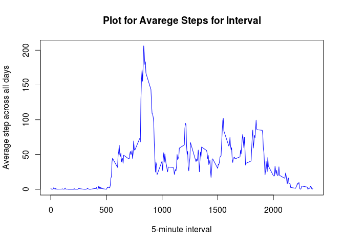

## 1.- Load data:


```r
row_data <-  read.csv(file = "activity.csv", header = TRUE, sep = ",")
```


## 2.- What is mean total number of steps taken per day?


```r
# Total number of steps per day
sum_steps <- aggregate(steps ~ date, row_data, sum)
print(head(sum_steps))
```

```
##         date steps
## 1 2012-10-02   126
## 2 2012-10-03 11352
## 3 2012-10-04 12116
## 4 2012-10-05 13294
## 5 2012-10-06 15420
## 6 2012-10-07 11015
```


```r
# Histogram of the total number of steps taken each day
library(ggplot2)

ggplot(data = sum_steps, aes(steps)) +
        geom_histogram(
                col = "red", 
                fill = "blue", 
                alpha = .2) + 
                labs(title = "Histogram for Total Steps") +
                labs(x = "Steps", y = "Count")
```

```
## `stat_bin()` using `bins = 30`. Pick better value with `binwidth`.
```

<!-- -->


```r
# Mean and median of the total number of steps taken per day
mean_steps_by_day <- mean(sum_steps$steps, na.rm = TRUE)
median_steps_by_day <- median(sum_steps$steps, na.rm = TRUE)
print(paste("Mean:", mean_steps_by_day, sep = " "))
```

```
## [1] "Mean: 10766.1886792453"
```

```r
print(paste("Median:", median_steps_by_day, sep = " "))
```

```
## [1] "Median: 10765"
```


# 3.- What is the average daily activity pattern?


```r
# Time series plot of the 5-minute interval and the average number of steps taken
mean_steps <- aggregate(steps ~ interval, row_data, mean)

plot(mean_steps$interval, mean_steps$steps, 
     type = "l",
     main = "Plot for Avarege Steps for Interval",
     xlab = "5-minute interval",
     ylab = "Average step across all days",
     col = "blue")
```

<!-- -->


```r
# 5-minute interval with the maximum number of steps
max_steps_by_interval <- mean_steps[mean_steps$steps == max(mean_steps$steps),]
```

Maximum steps in an interval:


```r
print(max_steps_by_interval)
```

```
##     interval    steps
## 104      835 206.1698
```


# 4.- Imputing missing values


```r
# Calculate the total number of missing values in the dataset
total_number_NA <- sum(is.na(row_data))
print(paste("Total number of NA:", total_number_NA, sep = " "))
```

```
## [1] "Total number of NA: 2304"
```

## Strategy for filling in all of the missing values: *use the average of the interval*


```r
# New dataset with the missing data filled in
net_data <- row_data
for (i in 1:nrow(net_data)) {
        
        if (is.na(net_data$steps)[i]) {
                
                net_data$steps[i] = 
                        mean_steps[mean_steps$interval == net_data$interval[i], ]$steps

        }
                
}
```

The main difference between the dataset with NA and the dataset without NA is basically at the beginig and the end of the period because at that time the highest number of observations with NA values occur


```r
# Histogram of the total number of steps taken each day with the new dataset
sum_steps_2 <- aggregate(steps ~ date, net_data, sum)
ggplot(data = sum_steps_2, aes(steps)) +
        geom_histogram(
                col = "red", 
                fill = "blue", 
                alpha = .2) + 
        labs(title = "Histogram for Total Steps without NA") +
        labs(x = "Steps", y = "Count")
```

```
## `stat_bin()` using `bins = 30`. Pick better value with `binwidth`.
```

<!-- -->

Given that the NA values have been replaced by the mean of the interval:

- Mean: there is not any difference between the datasets with or without NA 
- Median: there is an insignificant difference between the datasets with or without NA 


```r
## Mean and median of the total number of steps taken per day with the new dataset
mean_steps_by_day_2 <- mean(sum_steps_2$steps, na.rm = TRUE)
median_steps_by_day_2 <- median(sum_steps_2$steps, na.rm = TRUE)

## Variation of mean and median
mean_median_matrix <- matrix(
        c(mean_steps_by_day, mean_steps_by_day_2, median_steps_by_day, median_steps_by_day_2, 
          ((mean_steps_by_day_2 - mean_steps_by_day) / mean_steps_by_day) * 100 ,
          ((median_steps_by_day_2 - median_steps_by_day) / median_steps_by_day) * 100 ), 
        nrow = 2, 
        ncol = 3) 
colnames(mean_median_matrix) <- c("Mean", "Median", "% Variation")
rownames(mean_median_matrix) <- c("With NA", "Without NA")
print(mean_median_matrix, type = "html")
```

```
##                Mean   Median % Variation
## With NA    10766.19 10765.00  0.00000000
## Without NA 10766.19 10766.19  0.01104207
```

With the excepcion of the first and last days of the range of dates there is not many relevant differences between both datasets


```r
# Comparison of the initial dataset (with NA) and final dataset (without NA)
par(mfrow = c(1, 2), mar = c(4, 4, 2, 1))

barplot(height = sum_steps$steps,
        names.arg = sum_steps$date,
        ylab = "Steps",
        xlab = "Dates",
        main = "Total Steps with NA")

barplot(height = sum_steps_2$steps,
        names.arg = sum_steps_2$date,
        ylab = "Steps",
        xlab = "Dates",
        main = "Total Steps without NA")
```

<!-- -->


# 5.- Differences in activity patterns between weekdays and weekends?


```r
# Factor variable in the dataset with two levels: “weekday” and “weekend”
net_data_week <- row_data
net_data_week$type_day <- net_data_week$date
net_data_week$type_day <- as.Date(as.character(net_data_week$type_day))

library(lubridate)
```

```
## 
## Attaching package: 'lubridate'
```

```
## The following object is masked from 'package:base':
## 
##     date
```

```r
get_week_day <- function(x) {
        
        if(wday(x) == 6 | wday(x) == 1) {
                x = "weekend"
        }
        else {
                x = "weekday"
        }
}

net_data_week$type_day <- sapply(net_data_week$type_day , get_week_day)
net_data_week$type_day <- factor(net_data_week$type_day)
```

It is easy to check the differences between weekday and weekend. For example, the weekend activity starts later and, in general, higher than during the week


```r
# Panel containing the 5-minute interval averaged across all weekday days or weekend days
mean_steps_2 <- aggregate(steps ~ interval + type_day, net_data_week, mean)

qplot(interval, steps, data = mean_steps_2,
        geom = "line",
        color = type_day,
        facets = type_day ~ .,
        main = "Panel for Steps by Type of Day") 
```

<!-- -->
